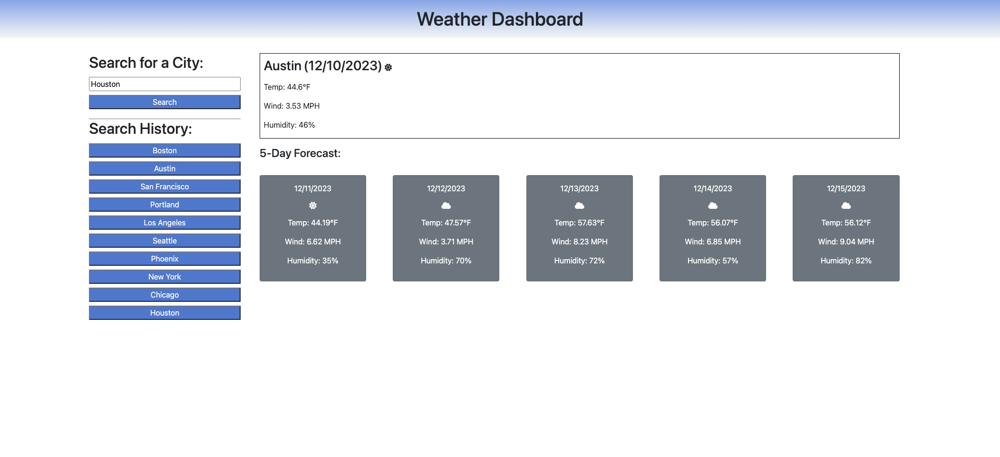
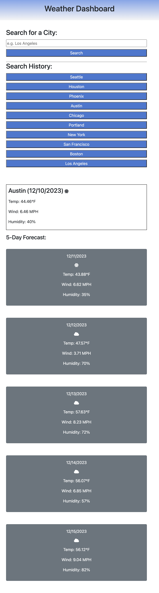

## Name 

Weather Dashboard 

## Description

The goal of this project is to create a webpage that utilizes server-side APIs so that users can query the current and 5-day forecast for a specific city. 

This project collects weather data from the OpenWeather "5 day weather forecast" API. The documentation can be found at the link below: 
https://openweathermap.org/forecast5

The weather dashboard webpage has 4 main sections outlined below: 
1. Form Input 
- A search input box that allows users to query a city of their choice. 
- Pressing the Search button will make an API call to collect the current and future conditions for the city entered. 

2. Search History 
- A list of previously queried cities. 
- Clicking on a city under the Search History section will again present the user with the current and future conditions for that city

3. Current Forecast 
- Displays the current forecast for the city in question. 
- The user will be presented with the city name, the date, an icon representation of weather conditions, the temperature, the humidity, and the the wind speed.

4. 5-Day Forecast 
- Displays the 5-day forecast for the city in question. 
- The user will be presented with the date, an icon representation of weather conditions, the temperature, the humidity, and the the wind speed.

## Installation 

N/A

## Usage 
Use the following link to access the deployed webpage: 
https://dymoy.github.io/weather-dashboard/

The source code is found in the root directory of the main branch. 

## Visuals 

### Screenshot of the web page on large sized screens (≥992px)

### Screenshot of the web page on medium sized screens (≥768px)

### Screenshot of the web page on small sized screens (<768px)

## Libraries, Frameworks, and Toolkits Used

1. Bootstrap 
- Bootstrap library is used to simplify HTML element styling 
- Documentation: https://getbootstrap.com/

2. Font Awesome 
- Font Awesome icon toolkit was used to for icon representation of weather conditions
- Documentation: https://fontawesome.com/docs

3. jQuery
- jQuery library is used to simplify DOM traversal and manipulation
- Documentation: https://jqueryui.com/demos/

4. Day.js 
- Day.js library is used to display and format the date and time. 
- Documentation: https://day.js.org/en/

## License 

Please refer to the license in the repo.